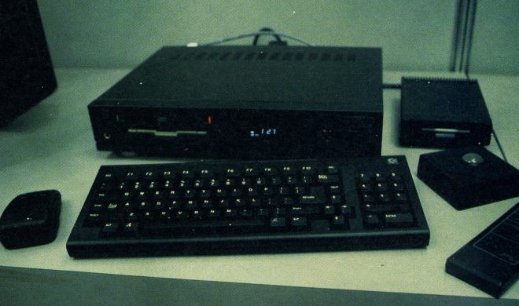
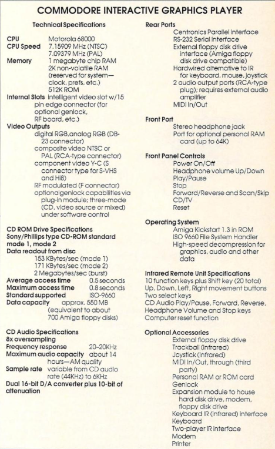

# Amiga-CDTV-U75

## What is the U75?

The U75 ROM chip is unique to the Commodore Amiga CDTV. It handles communication for the two rear ports ("REMOTE" and "K/B"), as well as the front Infra-Red (IR) sensor and the buttons on the CD1000 unit itself.

This firmware acts as the receiver for the two IR remote controllers (252594-1 and 252594-2), the front panel of the CD1000 base unit, the CD1200 trackball (IR & wired), the CD1221 keyboard (wired), the CD1252 mouse (IR), and the CD1253 mouse (wired).

For the most part, the IR (front IR sensor IRDT) and the "REMOTE" (rear peripheral port PRDT) protocols are the same. The mouse, joystick, remote controller, and keyboard each have their own protocols, which will be documented with demonstrators shortly.

This is perhaps the first public outing for this 36-year-old (1990–2026) ROM. It gives Amiga aficionados insight into 6500 assembly programming of that era and provides builders with a very clear picture of how these devices worked—so they can now build new ones.

---

## An acknowledgement to CDTV Land
This project would not exist without the work of CDTV Land, who, in June 2022, dumped the 6500/1 and LC6554H ROMs from a pre-production CD1000 prototype fitted with EPROM piggyback boards. That dump is the source of U75-ROM-dump.csv included in this repository and is the binary on which this entire disassembly is based.

The motivation stated in that post—enabling community replacements and keeping CDTV systems alive—is exactly what this project is intended to support.

Is CDTV Land's ROM final? I do not think so, but I believe it is close. While dynamic analysis proved that each peripheral worked flawlessly with that ROM, the final bytes in the firmware suggest otherwise. They appear to be keyboard scan codes, and they do not match a CD1221. But see below…

---

## Files in this repository

|  File | Description |
|---|---|
| `U75-6500.asm` | Fully annotated 6500 syntax assembly (syntax)
| `U75-Ghidra.txt` | Ghidra export — raw annotated listing exported from the disassembler. Useful as a cross-reference. |
| `U75-ROM-dump.csv` | CDTV Land's ROM as a CSV for radability (512 rows × 9 columns: address + 8 data bytes). Useful for byte-level verification. |

---

## How was this done?

The 6500/1 ROM from CDTV Land (U75-ROM-dump.csv) was imported into NSA's Ghidra for manual static analysis, using input from the CDTV schematics, the 6500/1 datasheet, and documented IR protocols.

As the static analysis neared completion, the ROM was then loaded into a modified 6502 emulator, and a test harness was built to simulate signal input. This dynamic analysis was used to validate assumptions from the static work. This harness was a fully automated Claude-assisted code project.

The harness exercised all ~1000 lines of assembly; only around five bytes of dead code were identified. Comments were refined throughout. Each peripheral was also reverse-engineered, allowing comparison between transmitter and receiver implementations.

Finally, Anthropic Claude was used to review the entire codebase in detail and correct any remaining issues. The reverse engineering should therefore be highly accurate.

---

## Did we learn anything?

Not a huge amount—most of the protocols had already been documented over the years by analysing signals emitted by the peripherals. However, the dual joystick protocol had not been formally documented and is now covered under the Brick project.

But!!!! Was there a peripheral that existed that never made it to production? Absolutely! The CDTV Infra-Red wireless keyboard, or "Keyboard IR (infrared) interface", as seen in a magazine (in optional accessories).

The CDTV Land firmware keyboard scan codes match the keyboard (a US Amiga 1000 keyboard) shown above. Does that firmware contain the code required to support that keyboard wirelessly? It does!
If we extract that code and derive the protocol, can we enable wireless keyboard functionality on a real CDTV?
We can indeed :) Full working code will be uploaded shortly....

---

## Related project

[**Amiga-CDTV-Brick**](https://github.com/Korinel/Amiga-CDTV-Brick) — RP2040 firmware that
reads physical joysticks and transmits CDTV-compatible IR frames, allowing standard Amiga
joysticks to control a CDTV.

---
